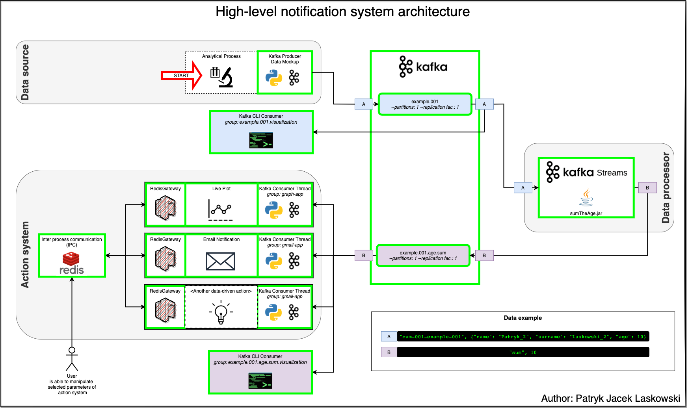

# vspu-notification-system
Notification system for Video Stream Processing Unit<br><br>
<b>Process data in real time to finally trigger data-driven actions.</b>


[](https://www.python.org/)
[](https://java.com/)
[](https://kafka.apache.org/)
[](https://maven.apache.org/)
[](https://redis.io/)
[](https://www.docker.com/)


---

## Overview:
### Action system
- [x] Live matplotlib plot
- [x] Email notificaiton (Gmail SMTP):<br>
      Send email based on incoming data stream and either dynamic or static limit value.
      System sources data from Kafka topic and compare to current limit.
      If data value exceeds limit value, sends email.
- [x] Database for IPC<br>
blah blah
### Data  processor (Kafka Streams)
- [x] SumTheAge
- [ ] 
### Data source
- [x] Script simulates input data

---

## High-level notification system architecture

<p align="center">
  
</p>

---

## Prepare Environment

### Clone repository
```bash
git clone https://github.com/patryklaskowski/kafka-vspu.git &&
cd kafka-vspu
```

### Create Kafka topics using Kafka CLI
> **_NOTE:_**  Assumed that Kafka is installed and it's bin directory is added to path

#### Topic: example.001
```bash
kafka-topics.sh --zookeeper 127.0.0.1:2181 \
--topic example.001 \
--create \
--partitions 1 \
--replication-factor 1
```

#### Topic: example.001.age.sum
```bash
kafka-topics.sh --zookeeper 127.0.0.1:2181 \
--topic example.001.age.sum \
--create \
--partitions 1 \
--replication-factor 1
```

---
## Run software

### 1. Kafka CLI example.001 Consumer (group: example.001.vis.app)
```bash
kafka-console-consumer.sh --bootstrap-server 149.81.197.180:9092 \
--topic example.001 \
--group example.001.vis.app \
--from-beginning \
--formatter kafka.tools.DefaultMessageFormatter \
--property print.key=true \
--property print.value=true \
--property key.deserializer=org.apache.kafka.common.serialization.StringDeserializer \
--property value.deserializer=org.apache.kafka.common.serialization.StringDeserializer
```

> **_NOTE:_**  To reset group offset to very beginning
> ```bash
> kafka-consumer-groups.sh --bootstrap-server 149.81.197.180:9092 \
> --topic example.001 \
> --group example.001.vis.app \
> --reset-offsets --to-earliest \
> --execute
> ```

### 2. "sumTheAge" Kafka Streams Application
```bash
java -jar kafka-streams/sumTheAge-kafka-streams/target/sumTheAge-kafka-streams-1.0-jar-with-dependencies.jar
```

### 3. Kafka CLI example.001.age.sum Consumer (group: example.001.age.sum.vis.app)
```bash
kafka-console-consumer.sh --bootstrap-server 149.81.197.180:9092 \
--topic example.001.age.sum \
--group example.001.age.sum.vis.app \
--from-beginning \
--formatter kafka.tools.DefaultMessageFormatter \
--property print.key=true \
--property print.value=true \
--property key.deserializer=org.apache.kafka.common.serialization.StringDeserializer \
--property value.deserializer=org.apache.kafka.common.serialization.IntegerDeserializer
```

> **_NOTE:_**  To reset group offset to very beginning
> ```bash
> kafka-consumer-groups.sh --bootstrap-server 149.81.197.180:9092 \
> --topic example.001.age.sum \
> --group example.001.age.sum.vis.app \
> --reset-offsets --to-earliest \
> --execute
> ```

### 4. Live Plot Python Consumer
```bash
cd python-kafka-consumer &&
python3.7 -m venv env &&
source env/bin/activate &&
python3 -m pip install -r requirements.txt &&
python3 live_plot_consumer.py --limit 10000 --window 50 --interval 300
```

### 5. Email Notification Python Consumer
```bash
```

### 6. Python Data Producer Mockup
```bash
cd python-kafka-producer-mockup &&
python3.7 -m venv env &&
source env/bin/activate &&
python3 -m pip install -r requirements.txt &&
python3 kafka-python-sumTheAge-producer.py --min -5 --max 7 --sleep 0.2 -n 200
```

<p align="center">
  
</p>

---

